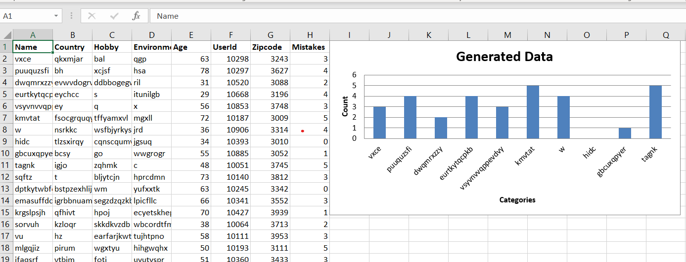

# ADF-ingesting-data-tutorial
Ingesting data with Azure Data Factory 

# Prerequisites

- Python 3 installed on your local machine 
- Microsoft excel installed on your local machine 

# How to use this script 

Clone the repository to your local machine 
Then install the libraries using the requirements.txt file 
or just install the library called openpyxl.

Run the following command in your terminal 

-   `python generating_excel_for_azure_data_factory.py` 

The RandomData.xlsx file should now be generated in the same folder where cloned the code too.

Your data will look similar to the data shown in the picture below but it would never be the same since we are using the random library. 

## Renaming excel file 

If you want to give the data a more fitting name please change the string on line 49
-   `wb.save("RandomData.xlsx")`
change this string to anything you like. 

### Thank you 
Thank you for taking the time to do this tutorial good luck on your journey and stay positive. 

#### PS
If enough people don't have microsoft word on their machines I can make a updated version that uses Libreoficce or any other opensource alternative for microsoft excel. 